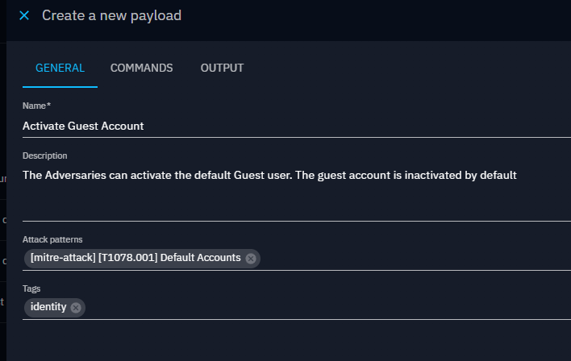
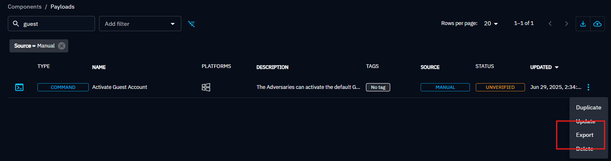
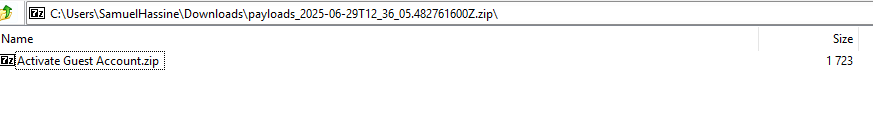
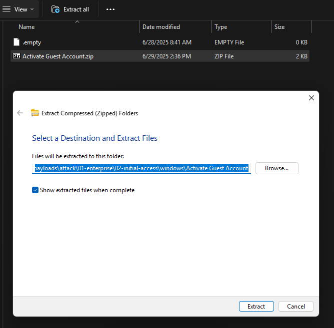
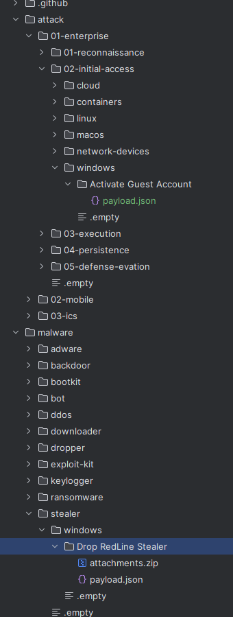
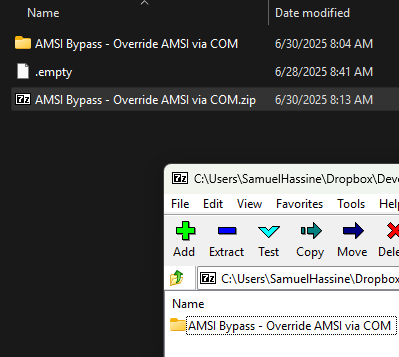
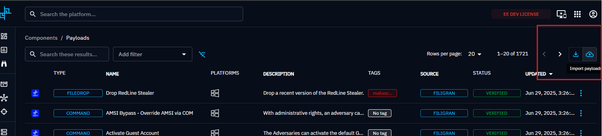

# OpenBAS Payloads Repository

## Purpose

This repository hosts default payloads collected by the OpenBAS datasets collector. 

## How to contribute to new payloads

### 1. Create your payload within OpenBAS

The first step is to create the payload in an OpenBAS Platform. Be sure to fill the description, associate with relevant MITRE ATT&CK TTPs and put any relevant tagging.



### 2. Test your payload

Please ensure that your payload is working in the supported environments by testing it using atomic testing or a more complex scenario if necessary.

### 3. Export your payload

Once tested, you can export your payload directly from the platform. 



### 4. Extract the payload content within the relevant directory

The downloaded ZIP file contain another ZIP file named with the payload name. This ZIP file should be extracted as a directory in the relevant folder of this repository.



In the example above, just take `Activate Guest Account.zip` and extract it to create a folder `Activate Guest Account` within this repository.



### 5. Verify directory structure and generate manifest

In a payload directory, you've only the `payload.json` file and an optional `attachments.zip` containing a potential malicious file (encrypted archive). *Do not unzip this file, let it as it is*.



Before opening your pull request, just run the Python script `scripts/generate_manifest.py`.

```bash
$ python3 scripts/generate_manifest.py
```

## How to review payloads

### 1. Create a zip from the payload folder

You can just select the payload folder and create a ZIP file.



### 2. Import the payload in OpenBAS

Then, just import the payload in OpenBAS.



### 3. Test the payload

Then, test the payload and validate it works before marging the pull request.

## About

OpenBAS is a product designed and developed by the company [Filigran](https://filigran.io).

<a href="https://filigran.io" alt="Filigran"></a>