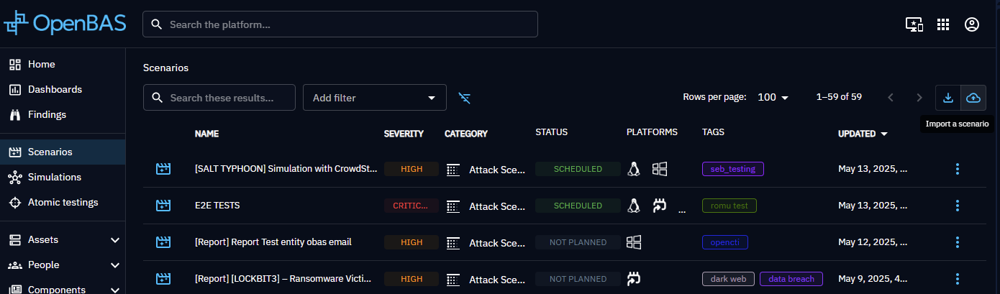

# OpenBAS Scenario Repository
## 🎯 Purpose

This repository hosts curated scenarios for the OpenBAS platform, contributed by internal teams and the community. These scenarios are designed to simulate offensive campaigns, test injectors, or demonstrate detection and response capabilities — supporting red, blue, and purple teaming efforts.

## 📁 Repository Structure

```All scenario files are located directly in the scenarios/ folder and are ready for import into OpenBAS.
.
├── scenarios/
│   ├── Akira Ransomware.zip
│   ├── Deploy OpenBAS Agents Like an Adversary and Validate Your Security Posture.zip
│   └── DragonForce Ransomware.zip
```
Downloaded individually
Imported directly into the OpenBAS interface
Customized to reflect specific use cases
## 🚀 How to Use

  - Navigate to the scenarios/ folder.
  - Download the scenario file(s) you want.
  - In your OpenBAS platform, go to Scenarios > Import button (top right corner).
  - Upload the ZIP file to begin using the scenario.
  - You can import scenario on your OpenBAS platform
    

## 🧪 Current Scenarios
### Current Scenarios
| Scenario Name           | Description                                         |
|-------------------------|-----------------------------------------------------|
| Akira Ransomware        | Simulates techniques used by Akira actors. Credit to **skandler** [GitHub Repository](https://github.com/skandler/simulate-akira) |
| DragonForce Ransomware  | Emulates ransomware tactics from DragonForce. Credit to **marcopedrinazzi** [GitHub Repository](https://github.com/marcopedrinazzi/simulate-dragonforce-ransomware) |
| Deploy OpenBAS Agents.. | Simulates techniques used by bad guys to deploy C2 beacons through SMB thanks our new installation-mode of OpenBAS agents introduce in 1.14.0. Credit to **Seb-MIGUEL** [GitHub Repository](https://github.com/Seb-MIGUEL) |


## 🤝 Contributing

We welcome contributions from the community!
To add your own scenario:
  - Create a valid OpenBAS scenario
  - Export it with the "Export Scenario" button (top right corner)
  - Add the downloaded Zip file to the scenarios/ folder.
  - Submit a pull request with a clear description.
  - Please follow naming conventions and provide meaningful metadata within your scenarios.

Please mind about keeping personal data out of exports!

## 📬 Contact & Community
Questions, feedback, or want to discuss scenario design?
Join the OpenBAS Slack or open an issue in this repository.
