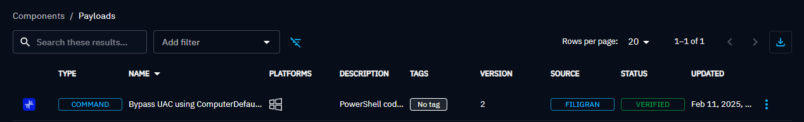
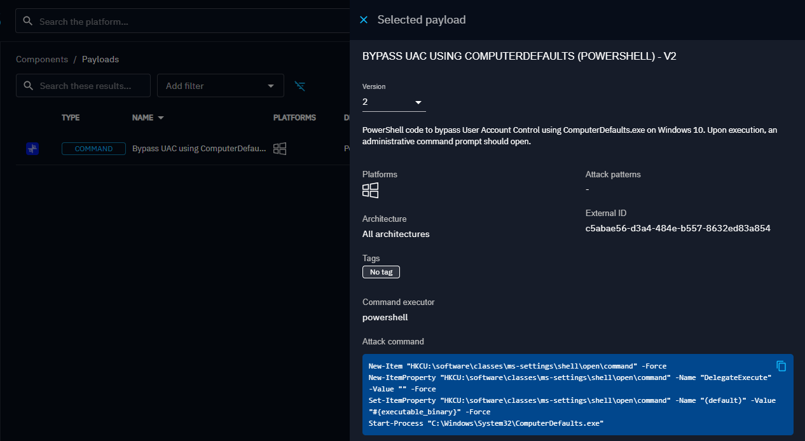
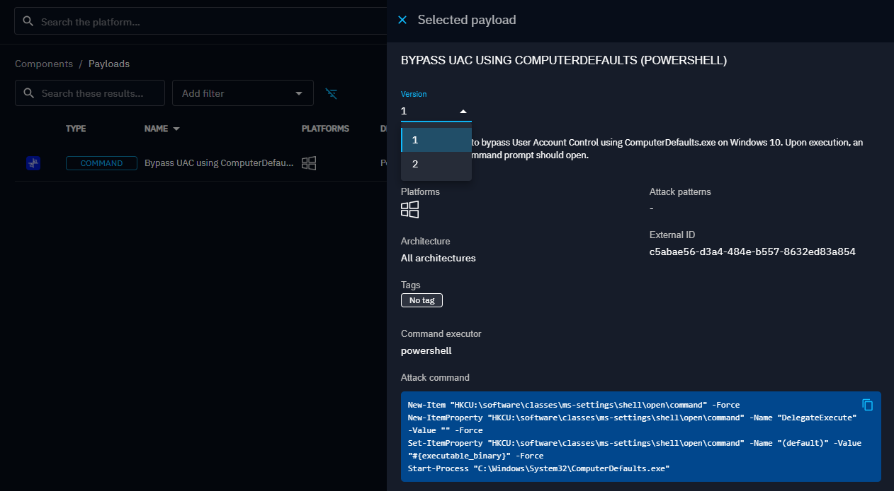

# OpenBAS Payload Repository

## 📦 Payload

### 📑 Json Structure

The JSON structure consists of:

- Root properties, including the TTP ID and name.
- A list of payloads associated with this TTP.

Payload properties are directly inherited from the OpenBAS payload model.
The only new properties is version.

### Unicity mechanism

Each payload has a unique identifier (payload_external_id).

🔹 Current approach:
- We upsert the payload based on its external_id.

🔹 New approach :
Each payload has a unique identifier (payload_external_id) and a version (payload_version).

- If the payload don't have any version, an upsert is done
- If a payload with the same external_id already exists and the version is identical, an exception is throw.
- If a payload with the same external_id already exists and the version is higher, a new payload is created.

🔹 UI
- Show version on payload list and only highest version by payload

- Change version on payload selection



## 📜 Scripts

### 🔄 JSON Merger Script

**Standalone Node.js script** (`compute-json.js`) that **recursively scans a directory** for `.json` files and merges
them into a single file.

#### 🔍 How It Works

- **Scans** the given directory and its subdirectories.
- **Finds all `.json` files** and reads their content.
- **Concatenates** all JSON objects into a list.
- **Saves the result** in a single `merged.json` file.

#### 🛠 Usage

##### 📥 Install Node.js (if needed)

Download it from [nodejs.org](https://nodejs.org/).

##### 🚀 Run the script

Execute the script with:

```sh
node scripts/compute-json.js
```  

##### 📂 Output

📄 A new file `merged.json` will be created in the **indexes folder**, containing all JSON objects **merged into an array
**. 🎯  
